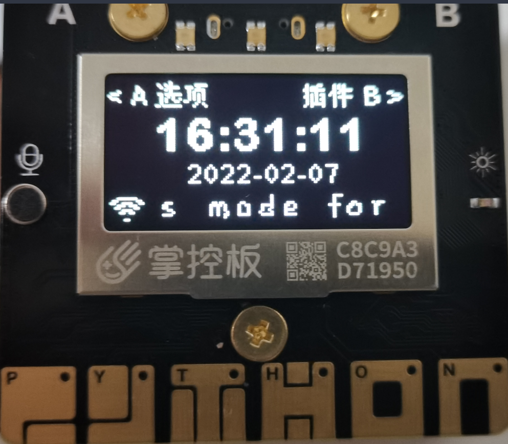
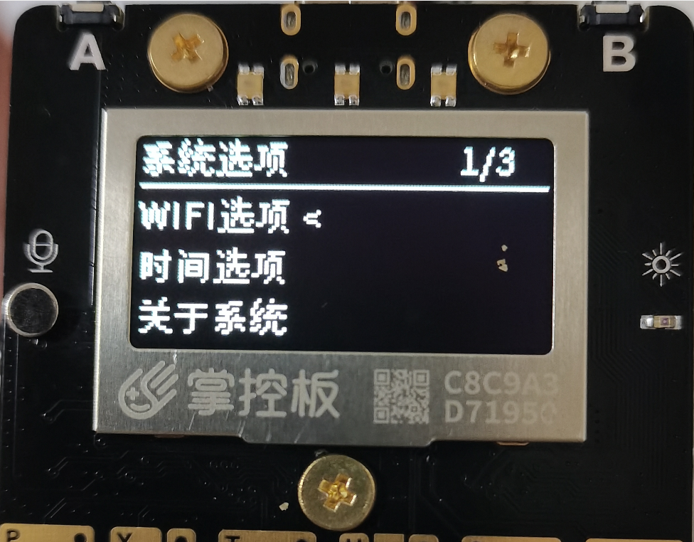
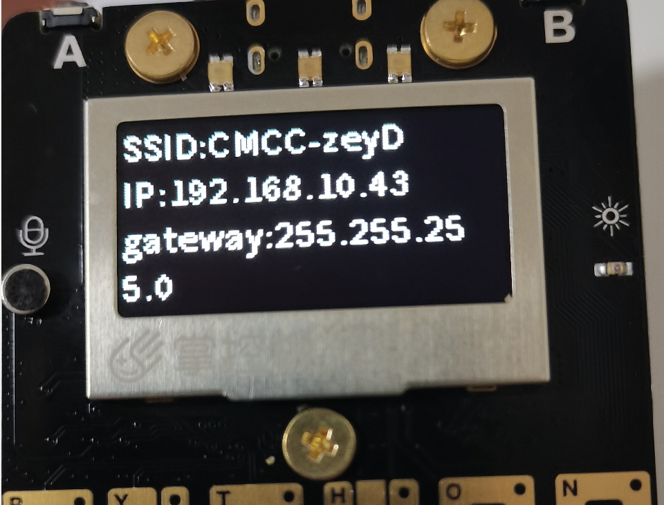
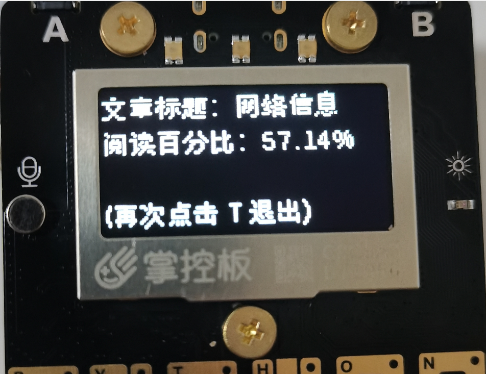
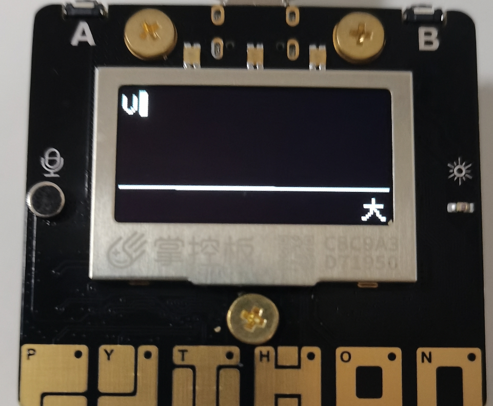

# 桃丽掌控板系统

#### 故事以及介绍
信息技术必修二的某一章中有关于开发板micro:bit的介绍，这吸引了我的注意。便促使了我从信息老师桃丽那里“借”了一本信息技术必修二的教师用书，并开始了一系列的探索。

从教师用书里面发现了一个叫做掌控板的开发板。于是在高一的寒假我打算制作一个“掌控板系统”来送给我们貌美如花、聪明、美丽、睿智、优雅、智商堪比爱因斯坦（此处省略一万字彩虹屁）、像 **桃（陶）** 花一样美 **丽** 的信息老师桃丽。在征得了她的同意后，我决定将她的名字引用为系统的名字——“桃丽系统 TaoLiSystem”（简称 “TLCS”）。

经过不懈的努力与开发，桃丽系统的雏形逐渐完善。

下面我将介绍桃丽系统的各个框架。

#### 软件架构

```
TaoLiSystem
│  boot.py                  # 掌控板启动一定会运行的文件，非必要，这里面设计了开机动画
│  main.py                  # 桃丽系统主要引导文件，从这里开始会调用 TaoLiSystem 文件夹内的文件
│  tips.py                  # 没什么用的文件，用于开发者开发时记录的“记事本”
└─TaoLiSystem               # 桃丽系统的核心文件会放在 TaoLiSystem 中
    │  config.json          # 桃丽系统的配置文件
    │  config.py            # 桃丽系统调用配置文件的模块
    │  function.py          # 桃丽系统整合的使用函数的模块
    │  image.py             # 桃丽系统存储小图片的模块
    │  ItemSelector.py      # 桃丽系统的物品选择器模块
    │  loader.py            # 桃丽系统的初始化加载
    │  morseType.py         # 桃丽系统的摩尔斯电码输入模块
    │  TXTreader.py         # 桃丽系统的文本阅读模块
    │  wifi.py              # 桃丽系统用于控制wifi的模块
    ├─font                  # 桃丽系统的调用的字体所放的目录
    │      arlrdbd.py       # Arial Rounded MT Bold 字体 (个人使用，不得商用)
    │      HYShiGuangTiJ.py # 汉仪时光体简 Regular 字体 (个人使用，不得商用)
    ├─page                  # 桃丽系统页面存放目录
    │      home.py          # 桃丽系统主页源码
    │      plugin.py        # 桃丽系统插件页源码
    │      setting.py       # 桃丽系统设置页源码
    ├─picture               # 桃丽系统图片放置目录
    │      loadingPage.bmp  # 加载页面图片
    │      waitingPage.bmp  # 等待页面图片
    └─plugin                # 插件存放目录
```

#### 安装教程

1.  因为源码即是完整的程序，所以第一步就是克隆整个仓库。这一步相信大家都非常内涵，这里不过多介绍。
2.  向掌控板内烧录固件。开发时所使用的固件为 mpython 提供的 掌控板官方固件v2.3.3 (2021-12-20) ，实际测试下来 v2.3.X 的固件均可使用此系统。
(1)  烧录固件的过程我们只提供一种不太靠谱但是简单的方法，如果大家想用更高级的刷入方法，请参考官方文档：https://mpython.readthedocs.io/zh/master/board/flashburn.html
(2)  下载 mpython IDE，下载链接：https://mpythonsoftware.readthedocs.io/ , 安装好后，使用数据线链接您的掌控板并打开 IDE。此时 IDE 会自动连接，若没有请点击上方的"未连接"-"连接COMX"：


(3) 根据操作连接上掌控板后，点击右上角的“设置”-“烧录固件”


(4) 在弹出的页面中选择最新的固件并烧录


3. 在烧录完成固件之后就是上传桃丽系统的所有文件了， mPython IDE 虽然设计的非常容易上手，但是在与掌控板文件交互的方面做的非常糟糕，所以想要上传文件我这里有两个建议：使用其它的IDE连接掌控板上传或者慢慢使用mpython慢慢上传。
4. 这里我们还是用 mpython 介绍，当然我们更推荐使用其它 IDE 如：Thonny、BXY（测试的时候死活连不上我的掌控板，不知道为什么）


5. 在控制台内输入 machine.reset() 重置掌控板即可体验桃丽系统。

#### 使用说明

1.  此系统目前有个最大的BUG：在运行较大的插件时会导致运行内存不够分配导致系统崩溃重启，这个方法现在仍未得到解决。现在目前的解决临时的解决方法是在 main.py 文件中使用 try 语句来拦截报错，虽然可以有效防止系统奔溃，但是实际上没有什么用。所以在使用插件前还是建议先重启一下掌控板在调用插件。下面几个点会讲解各个页面的使用教程。

2.  主页面使用说明

(1) 按键提示
    按下 A 进入选项、按下 B 进入插件。A、B 操作方法均为长按。 按下触摸键 P 会弹出 “掌控板” 信息页面，按下触摸键 Y 会弹出 “拓展版” 信息页面。

(2) 左下角 WIFI图标、右中下横幅、中间时间与日期显示。

(3) 主页页面实例



3.  选择器页面（设置页面、插件选择页面）

(1) 按键提示
     A 确定、B 取消、触摸键 P 上移一个、触摸键 N 下移一个、触摸键 T 最上、触摸键 H 最下

(2) 上方标题、右上方个数指示、其余为选项。

(3) 选择器页面实例



4.  文本阅读页面(WIFI信息页面、插件信息页面)

(1) 按键提示
    A 向上翻页、B 向下翻页、触摸键 T 显示基本信息、触摸键 H 退出阅读、触摸键 P 上移一行、触摸键 N 下移一行

(2) 全部为文章内容在基本信息页面会显示阅读百分比

(3) 文本阅读页面实例





5.  摩尔斯电码输入页面

(1) 按键提示
    A = . ；B = -；A+B = 完成输入；触摸键 P 上移光标；触摸键 N 下移光标；触摸键 T 切换大小写；触摸键 H 删除一个字

(2) 上方为输入文本内容、下方为输入框

(3) 摩尔斯电码输入页面实例




#### 开发说明

已经写到 tips.py 里了，内容如下：


```
# tips.py 只是一个用来记录的 py 文件，这个文件在系统运行时不会进行任何调用，用于二次开发与提示

# ------系统运行流程------
# 程序运行会被掌控板默认调用文件 boot.py ，这个 boot.py 比较迷惑，
# 不仅仅在掌控板重启先调用（正常运行下），而且在运行单个文件时，系统也会默认调用这个文件。
# 举个例子：假设我要运行我写的 test.py ，并在编译器里面直接单文件执行。掌控板也会最先调用 boot.py 然后在运行 test.py 。
# boot.py 按正常运行完毕后，掌控板会自动 main.py 作为系统主要的入口点。
# 在我设计的 main.py 中，主要实现的是：设置好系统运行时初始化的变量，然后再导入 loader.py 开始加载。
# 在导入 loader.py 之前，会定义各种全局变量，即使是空值也定义，为的是提示后人开发时程序会申请那些全局变量。
# loader.py 是在桌面加载前调用的，可以用于自动连接wifi、自动校准时间、插件自启动等等。
# 回到 main.py ，接下来就是加载主页面了，程序页面分为四个大类： home(主页面) setting(设置页面) plugin(选择插件页面) plugindiy(插件运行页面)
# 其中除了 plugindiy 以外都是系统内置设计好的页面。
# 再次回到 main.py ，接下来就是运行一个 checkEvent() 线程，这个线程主要是来不断检查用户是否在指定页面按下指定的按键。
# 实际上目前的 checkEvent() 只在主页面有效，因为其它页面均为 ItemSelector() 的套壳。
# 紧接着就是显示页面了，和 main.py 没什么关系了。main.py 会根据全局变量中 page 的值显示指定页面。

# ------页面的显示------
# page 文件夹中就是系统内置的页面了，对应关系如上面。

# -----内置功能使用-----
# TXTreader： # A 向上翻页、B 向下翻页、T 显示基本信息、H 退出阅读、P 上移一行、N 下移一行
# :调用例子:
# from TaoLiSystem.TXTreader import TXTreader as TXTreader
# TXTreader("正文", "标题").start()
#
# ItemSelector： A 确定、B 取消、P 上移一个、N 下移一个、T 最上、H 最下
# :调用例子:
# from TaoLiSystem.ItemSelector import ItemSelector as ItemSelector
# ItemSelector(["选项1", "选项2"], "标题").start() -> 选择项名称


# -----插件编写注意-----
# 插件的代码内容没有硬性规定，但是为了可以标识插件名称、作者、版本、介绍等信息
# 插件均以英文命名并放在 plugin 文件夹内
# 所以硬性规定开头必须写一个 json 注释，大体内容如下：
# {"Name": "插件名称","Version": "v0.0.1","Master": "插件制作者","Description": "插件介绍", "More": "更多说明会直接附在插件页面后面", "Filename":"文件名非必须，服务器必须加为插件下载地址"}

# 写插件时其实出现了一个问题：若 exec 在非 main.py 执行会出现代码内容访问模块级变量的情况，所以把加载插件的东西放在 main.py 中了。


# -----主页使用说明-----
# A 键 = 设置页面； B 键 = 插件页面
# P 触摸键 = 掌控板信息（B 退出） Y 触摸键 = 拓展版信息（B 退出）

# ---摩尔斯输入说明---
# A = . ；B = -；A+B = 完成输入
# P 上移光标 N 下移光标 T 切换大小写 H 删除一个字
```

插件上传说明：目前没有提供接口，请加QQ群532564781联系以赏。

#### 感谢名单

**桃丽**      -----------------    人见人爱的高中信息老师

张以赏        -----------------    桃丽系统主要开发人员

林子琪        -----------------    一位不断提供建议的同学

皮卡丘        -----------------    非常可爱的一个卡通人物

Niko          -----------------   Oneshot中的救世主

?????        ------------------    默默付出的你们


#### 参考资料

掌控板/mPython 官方文档： [https://mpythonsoftware.readthedocs.io/](http://https://mpythonsoftware.readthedocs.io/)

#### 参与贡献

1.  Fork 本仓库
2.  新建 Feat_xxx 分支
3.  提交代码
4.  新建 Pull Request
