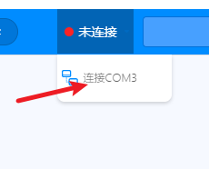
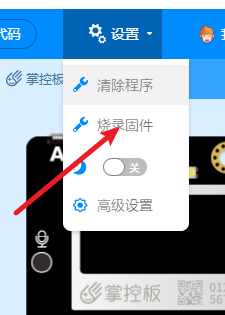
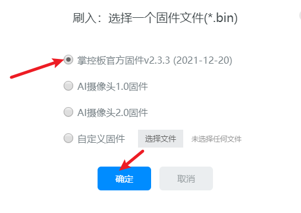
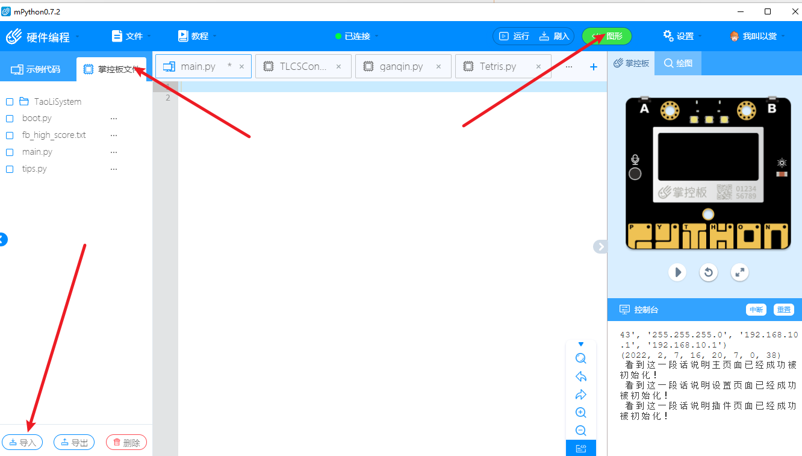

# 陶丽掌控板系统

#### 故事以及介绍
信息技术必修二的某一章中有关于开发板micro:bit的介绍，这吸引了我的注意。便促使了我从信息老师陶丽那里“借”了一本信息技术必修二的教师用书，并开始了一系列的探索。

从教师用书里面发现了一个叫做掌控板的开发板。于是在高一的寒假我打算制作一个“掌控板系统”来送给我们貌美如花、聪明、美丽、睿智、优雅、智商堪比爱因斯坦（此处省略一万字彩虹屁）、像 **桃（陶）** 花一样美 **丽** 的信息老师陶丽。在征得了她的同意后，我决定将她的名字引用为系统的名字——“陶丽系统 TaoLiSystem”（简称 “TLCS”）。

经过不懈的努力与开发，陶丽系统的雏形逐渐完善。

下面我将介绍陶丽系统的各个框架。

#### 软件架构

```
TaoLiSystem
│  boot.py                  # 掌控板启动一定会运行的文件，非必要，这里面设计了开机动画
│  main.py                  # 陶丽系统主要引导文件，从这里开始会调用 TaoLiSystem 文件夹内的文件
│  tips.py                  # 没什么用的文件，用于开发者开发时记录的“记事本”
└─TaoLiSystem               # 陶丽系统的核心文件会放在 TaoLiSystem 中
    │  config.json          # 陶丽系统的配置文件
    │  config.py            # 陶丽系统调用配置文件的模块
    │  function.py          # 陶丽系统整合的使用函数的模块
    │  image.py             # 陶丽系统存储小图片的模块
    │  ItemSelector.py      # 陶丽系统的物品选择器模块
    │  loader.py            # 陶丽系统的初始化加载
    │  morseType.py         # 陶丽系统的摩尔斯电码输入模块
    │  TXTreader.py         # 陶丽系统的文本阅读模块
    │  wifi.py              # 陶丽系统用于控制wifi的模块
    ├─font                  # 陶丽系统的调用的字体所放的目录
    │      arlrdbd.py       # Arial Rounded MT Bold 字体 (个人使用，不得商用)
    │      HYShiGuangTiJ.py # 汉仪时光体简 Regular 字体 (个人使用，不得商用)
    ├─page                  # 陶丽系统页面存放目录
    │      home.py          # 陶丽系统主页源码
    │      plugin.py        # 陶丽系统插件页源码
    │      setting.py       # 陶丽系统设置页源码
    ├─picture               # 陶丽系统图片放置目录
    │      loadingPage.bmp  # 加载页面图片
    │      waitingPage.bmp  # 等待页面图片
    └─plugin                # 插件存放目录
```

#### 安装教程

1.  因为源码即是完整的程序，所以第一步就是克隆整个仓库。这一步相信大家都非常内涵，这里不过多介绍。
2.  向掌控板内烧录固件。开发时所使用的固件为 mpython 提供的 掌控板官方固件v2.3.3 (2021-12-20) ，实际测试下来 v2.3.X 的固件均可使用此系统。
(1)  烧录固件的过程我们只提供一种不太靠谱但是简单的方法，如果大家想用更高级的刷入方法，请参考官方文档：https://mpython.readthedocs.io/zh/master/board/flashburn.html
(2)  下载 mpython IDE，下载链接：https://mpythonsoftware.readthedocs.io/ , 安装好后，使用数据线链接您的掌控板并打开 IDE。此时 IDE 会自动连接，若没有请点击上方的"未连接"-"连接COMX"：



(3) 根据操作连接上掌控板后，点击右上角的“设置”-“烧录固件”



(4) 在弹出的页面中选择最新的固件并烧录



3. 在烧录完成固件之后就是上传陶丽系统的所有文件了， mPython IDE 虽然设计的非常容易上手，但是在与掌控板文件交互的方面做的非常糟糕，所以想要上传文件我这里有两个建议：使用其它的IDE连接掌控板上传或者慢慢使用mpython慢慢上传。
4. 这里我们还是用 mpython 介绍，当然我们更推荐使用其它 IDE 如：Thonny、BXY（测试的时候死活连不上我的掌控板，不知道为什么）



5. 在控制台内输入 machine.reset() 重置掌控板即可体验陶丽系统。

#### 使用说明以及开发说明

1.  此系统目前有个最大的BUG：在运行较大的插件时会导致运行内存不够分配导致系统崩溃重启，这个方法现在仍未得到解决。现在目前的解决临时的解决方法是在 main.py 文件中使用 try 语句来拦截报错，虽然可以有效防止系统奔溃，但是实际上没有什么用。所以在使用插件前还是建议先重启一下掌控板在调用插件。下面几个点会讲解各个页面的使用教程。

2.  主页面使用说明

(1) 按键提示
    按下 A 进入选项、按下 B 进入插件。A、B 操作方法均为长按。 按下触摸键 P 会弹出 “掌控板” 信息页面，按下触摸键 Y 会弹出 “拓展版” 信息页面。

(2) 左下角 WIFI图标、右中下横幅、中间时间与日期显示。

(3) 主页页面实例


3.  选择器页面（设置页面、插件选择页面）

(1) 按键提示
     A 确定、B 取消、触摸键 P 上移一个、触摸键 N 下移一个、触摸键 T 最上、触摸键 H 最下

(2) 上方标题、右上方个数指示、其余为选项。

(3) 选择器页面实例


#### 参与贡献

1.  Fork 本仓库
2.  新建 Feat_xxx 分支
3.  提交代码
4.  新建 Pull Request


#### 特技

1.  使用 Readme\_XXX.md 来支持不同的语言，例如 Readme\_en.md, Readme\_zh.md
2.  Gitee 官方博客 [blog.gitee.com](https://blog.gitee.com)
3.  你可以 [https://gitee.com/explore](https://gitee.com/explore) 这个地址来了解 Gitee 上的优秀开源项目
4.  [GVP](https://gitee.com/gvp) 全称是 Gitee 最有价值开源项目，是综合评定出的优秀开源项目
5.  Gitee 官方提供的使用手册 [https://gitee.com/help](https://gitee.com/help)
6.  Gitee 封面人物是一档用来展示 Gitee 会员风采的栏目 [https://gitee.com/gitee-stars/](https://gitee.com/gitee-stars/)
