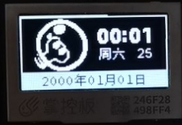
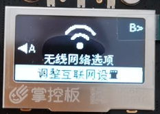
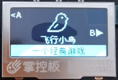

 
 
  <h1 align="center">
    TaoLiSytem 桃丽系统
  </h1>
  <h4 align="center">
    一个掌控板的UI方案
  </h4>

  [视频说明](https://www.bilibili.com/video/BV1Hi4y1f7fC)   | [安装方法](https://wojiaoyishang.gitee.io/taolisystem-doc/welcome/quickstart.html) | [使用说明](https://wojiaoyishang.gitee.io/taolisystem-doc/welcome/detail.html) | [开发文档](https://lab.lovepikachu.top/ebook/taolisystem/index.html)

    

桃丽系统是掌控板界面设计的一个方案，旨在将零散的代码汇集起来，便于同学老师编程。将掌控板变成一个确切、功能完善的设备。系统的宗旨是简单易用、可移植、易于编译。
此系统由以赏独立开发，特献给他高一的信息老师，陶丽老师（顺带一提，并不是百度搜到的那个陶丽老师哦！）。系统开发时参考了大量的文献资料，感谢每一位提供文献的小伙伴！

# 更新日志

> **⚠️注意** 2024年7月优化了掌控板代码，修正了部分 BUG ，感谢 [我叫罗米奇](https://gitee.com/romich) 提供的修正。
> 另外，增加了新的构建工具，可以自动下载代码到掌控板，不需要下载额外的工具，但是您的计算机必须装有 Python 或者其他可以运行
> Python 代码的工具。 关于桃丽系统文档，由于 Gitee Page 的服务调整，帮助文档已迁移到我自己的服务器上。
> 点击这里查看 [帮助文档](https://lab.lovepikachu.top/ebook/taolisystem/index.html) 。

> **⚠️注意** 2023年8月更新了桃丽系统 v2.0.0 版本，进行了全面重置，原版本查看分支 v1.0.0 ，v1.0.0 版本已不再更新和维护。

## 2024.7.19

> **⚠️注意** 更新 `v2.1.0` 版本，此版本有较大的更改，如需升级请认真阅读以下说明。

+ **Enhancement：** 优化了系统起始入口的代码，引入 loader 进行加载系统，面向对象，便于开发。 相关文件： `main.py`  `TaoLiSystem/core/loader.py`
+ **Enhancement：** 优化了设置页面的代码，使代码变的更易于查看。 `TaoLiSystem/page/settingFun.py`
+ **Feature：** 允许在掌控板中切换首页（切换表盘），并同时提供了 default（默认） 和 easy（示例首页） 两种首页样式，其他首页扔在开发欢迎提交 PR 。相关文件： `TaoLiSystem/page/home.py` -> `TaoLiSystem/page/home/`
+ **Feature：** 允许首页（表盘）自定义个性化设置，相关内容请查看文档。 相关文件： `TaoLiSystem/page/home/`
+ **Feature：** 修改设置项，将 `熄屏设置` 更改为 `屏幕设置` 。 相关文件： `TaoLiSystem/page/settingFun.py`
+ **Feature：** 新增浅度睡眠、深度睡眠、软重启、硬重启等设置项。 相关文件： `TaoLiSystem/page/settingFun.py`
+ **Feature：** 更新蓝牙设置功能和蓝牙信息查看（尚未测试），感谢 [我叫罗米奇](https://gitee.com/romich) 。 相关文件： `TaoLiSystem/page/settingFun.py`  `TaoLiSystem/core/utils.py`
+ **Fix：** 修复了首页熄屏无法唤醒问题，修复熄屏设置无效的问题。`` 相关文件： `TaoLiSystem/page/settingFun.py`
+ **Fix：** 修复了时间手动设置失效的问题和无法手动同步时间的问题。 [#I9KT1M](https://gitee.com/wojiaoyishang/TaoLiSystem/issues/I9KT1M) `` 相关文件： `TaoLiSystem/page/settingFun.py`
+ **Fix：** 修复了在文字输入页面按下 O 键无效的问题，感谢 [我叫罗米奇](https://gitee.com/romich) 的修正，并在文字输入页面增加了几个可以输入的字符。 `` 相关文件： `TaoLiSystem/core/sysgui.py`
+ **Fix：** 修复了在切换页面时反复按下按钮，无法切换的问题。 `` 相关文件： `TaoLiSystem/core/loader.py`
+ **Refactor：** 重构了配置文件的读取与设置，使用内置的 btree 数据库进行存储设置，速度加快。相关文件： `TaoLiSystem/core/config.py`

# 相关介绍

## 掌控板

掌控板是创客教育专家委员会、猫友汇、广大一线老师共同提出需求并与创客教育行业优秀企业代表共同参与研发的教具、学具，是一块为教育而生的开源硬件，也是一个公益项目。

mPython掌控板是一块MicroPython微控制器板，它集成ESP32高性能双核芯片，使用当下最流行的Python编程语言，以便您轻松地将代码从电脑传输到掌控板中，从而体验程序创作的无穷乐趣！

关于掌控板的更多信息可以参考 mPython掌控板文档 。顺带一提，上面的GIF是修改自官方的掌控板动态图片的。

## 特别说明

桃丽系统又称“陶丽系统”，在信息技术必修二的某一章中有关于开发板micro:bit的介绍，这吸引了我的注意。便促使了我从信息老师陶丽那里“借”了一本信息技术必修二的教师用书，并开始了一系列的探索。

从教师用书里面发现了一个叫做掌控板的开发板。于是在高一的寒假我打算制作一个“掌控板系统”来送给我们貌美如花、聪明、美丽、睿智、优雅、智商堪比爱因斯坦<del>（此处省略一万字彩虹屁）</del>、像桃（陶） 花一样美 丽 的信息老师陶丽。在征得了她的同意后，我决定将她的名字引用为系统的名字——“桃丽系统 TaoLiSystem”（简称 “TLCS”）。

上面这段文字是我高一时候写的，现在已经高中毕业，回头看满是感慨，感谢每一位老师的付出！此外同时也感谢余兴光老师和陈灵敏老师在高二高三的信息指导，同时也对通用技术老师杨守坤老师和林凯老师表示感谢！

# 快速浏览

|                                       |                                       |                                       |
|---------------------------------------|---------------------------------------|---------------------------------------|
|  |  |  |
| 主界面                                   | 设置界面                                  | 插件界面                                  | 

+ 全屏选择页面

  

+ 物品选择页面

  

+ 文字输入页面

  

