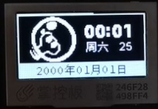
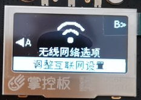
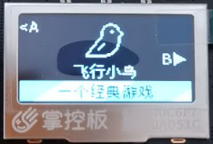
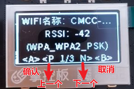
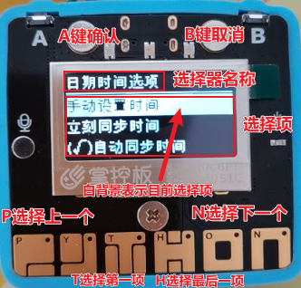
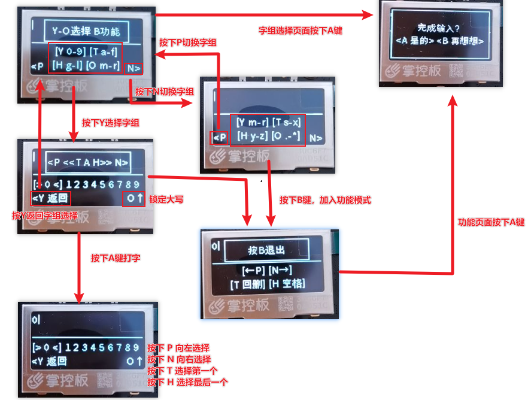

# 桃丽系统是什么

如何使用？如何开发？点击查看 -> [帮助文档](https://wojiaoyishang.gitee.io/taolisystem-doc/welcome/instruction.html)

桃丽系统是掌控板界面设计的一个方案，旨在将零散的代码汇集起来，便于同学老师编程。将掌控板变成一个确切、功能完善的设备。此系统由以赏独立开发，特献给他高一的信息老师，陶丽老师（顺带一提，并不是百度搜到的那个陶丽老师哦！）。系统开发时参考了大量的文献资料，感谢每一位提供文献的小伙伴！

桃丽系统又称“陶丽系统”，在信息技术必修二的某一章中有关于开发板micro:bit的介绍，这吸引了我的注意。便促使了我从信息老师陶丽那里“借”了一本信息技术必修二的教师用书，并开始了一系列的探索。

从教师用书里面发现了一个叫做掌控板的开发板。于是在高一的寒假我打算制作一个“掌控板系统”来送给我们貌美如花、聪明、美丽、睿智、优雅、智商堪比爱因斯坦（此处省略一万字彩虹屁）、像 桃（陶） 花一样美 丽 的信息老师陶丽。在征得了她的同意后，我决定将她的名字引用为系统的名字——“桃丽系统 TaoLiSystem”（简称 “TLCS”）。

# 掌控板是什么

掌控板是创客教育专家委员会、猫友汇、广大一线老师共同提出需求并与创客教育行业优秀企业代表共同参与研发的教具、学具，是一块为教育而生的开源硬件，也是一个公益项目。

mPython掌控板是一块MicroPython微控制器板，它集成ESP32高性能双核芯片，使用当下最流行的Python编程语言，以便您轻松地将代码从电脑传输到掌控板中，从而体验程序创作的无穷乐趣！

关于掌控板的更多信息可以参考 mPython掌控板文档 。顺带一提，上面的GIF是修改自官方的掌控板动态图片的。

# 快速浏览

|  |  |  |
|---------------------|---------------------|---------------------|
||||
|主界面|设置界面|插件界面|

+ 全屏选择页面

+ 物品选择页面

+ 文字输入页面

