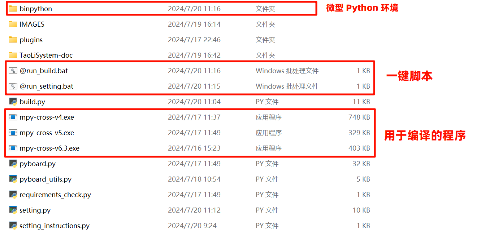

<div align="center">
<br/>
<br/>
  <h1 align="center">
    TaoLiSytem 桃丽系统
  </h1>
  <h4 align="center">
    一个掌控板的UI方案
  </h4>

   <!--| <p><a href="https://gitee.com/link?target=https%3A%2F%2Fwww.bilibili.com%2Fvideo%2FBV1Hi4y1f7fC">视频说明</a>   | <a href="http://lab.lovepikachu.top/document/TaoLiSystem/welcome/quickstart.html" rel="nofollow">安装方法</a> | <a href="https://wojiaoyishang.gitee.io/taolisystem-doc/welcome/detail.html" rel="nofollow">使用说明</a> | <a href="http://lab.lovepikachu.top/document/TaoLiSystem/index.html">开发文档</a></p> |-->
  <!---->
  [视频说明](https://www.bilibili.com/video/BV1Hi4y1f7fC)   | [安装方法](http://lab.lovepikachu.top/document/TaoLiSystem/welcome/quickstart.html) | [使用说明](http://lab.lovepikachu.top/document/TaoLiSystem/welcome/detail.html) | [开发文档](http://lab.lovepikachu.top/document/TaoLiSystem/index.html)
    <!---->
<p align="center">
    <a href="#">
       
    </a>
</p>
</div>

桃丽系统是掌控板界面设计的一个方案，旨在将零散的代码汇集起来，便于同学老师编程。将掌控板变成一个确切、功能完善的设备。系统的宗旨是简单易用、可移植、易于编译。
此系统由以赏独立开发。系统开发时参考了大量的文献资料，感谢每一位提供文献的小伙伴！

<!--|
[admonition title="注意" icon="exclamation-triangle" color="red"]<p>系统目前处于公测阶段，可能存在诸多问题，如果遇到了系统的 BUG **请尽量找出 BUG 的复现方法** 方便定位问题，有问题、建议、创意请提 Issues，有能力的同学可以提交 PR。</p>[/admonition]
|-->

<!---->
> **⚠️注意** 系统目前处于公测阶段，可能存在诸多问题，如果遇到了系统的 BUG **请尽量找出 BUG 的复现方法** 方便定位问题，有问题、建议、创意请提 Issues，有能力的同学可以提交 PR。
<!---->

|                                       |                                       |                                       |
|---------------------------------------|---------------------------------------|---------------------------------------|
|  |  |  |
| 主界面                                   | 设置界面                                  | 插件界面                                  | 


# 更新日志

<!--|
[admonition title="注意" icon="exclamation-triangle" color="red"]<p>2024年7月优化了掌控板代码，修正了部分 BUG ，感谢 [我叫罗米奇(https://gitee.com/romich) 提供的修正。另外，增加了新的构建工具，可以自动下载代码到掌控板，不需要下载额外的工具，但是您的计算机必须装有 Python 或者其他可以运行Python 代码的工具。 关于桃丽系统文档，由于 Gitee Page 的服务调整，帮助文档已迁移到我自己的服务器上。点击这里查看 [帮助文档](http://lab.lovepikachu.top/document/TaoLiSystem/index.html) 。</p>[/admonition]
|-->

<!--|
[admonition title="注意" icon="exclamation-triangle" color="red"]<p>2023年8月更新了桃丽系统 v2.0.0 版本，进行了全面重置，原版本查看分支 v1.0.0 ，v1.0.0 版本已不再更新和维护。</p>[/admonition]
|-->

<!---->
> **⚠️注意** 2024年7月优化了掌控板代码，修正了部分 BUG ，感谢 [我叫罗米奇](https://gitee.com/romich) 提供的修正。
> 另外，增加了新的构建工具，可以自动下载代码到掌控板，不需要下载额外的工具，但是您的计算机必须装有 Python 或者其他可以运行
> Python 代码的工具。 关于桃丽系统文档，由于 Gitee Page 的服务调整，帮助文档已迁移到我自己的服务器上。
> 点击这里查看 [帮助文档](http://lab.lovepikachu.top/document/TaoLiSystem/index.html) 。

> **⚠️注意** 2023年8月更新了桃丽系统 v2.0.0 版本，进行了全面重置，原版本查看分支 v1.0.0 ，v1.0.0 版本已不再更新和维护。
<!---->

## 2024.7.19

<!--|
[admonition title="注意" icon="exclamation-triangle" color="red"]<p>更新 <code>v2.1.0</code> 版本，此版本有较大的更改，如需升级请认真阅读以下说明。</p>[/admonition]
|-->

<!---->
> **⚠️注意** 更新 `v2.1.0` 版本，此版本有较大的更改，如需升级请认真阅读以下说明。
<!---->

+ **Chore：** 增加了构建工具和刷入工具，可以一键构建与刷入系统便于使用。制作了掌控板系统系统配置程序，方便调试修改配置。
+ **Chore：** 调整了目录架构，增加了 `resource` 文件夹存放开发时使用的工具、资源。
+ **Chore：** 移除了不常用的插件，放在了 `resource/plugins` 文件夹下。
+ **Enhancement：** 优化了系统起始入口的代码，引入 loader 进行加载系统，面向对象，便于开发。 相关文件： `main.py`  `TaoLiSystem/core/loader.py`
+ **Enhancement：** 优化了设置页面的代码，使代码变的更易于查看。 `TaoLiSystem/page/settingFun.py`
+ **Feature：** 允许在掌控板中切换首页（切换表盘）和编排页面，并且支持热更新，并同时提供了 default（默认） 和 easy（示例首页） 两种首页样式，其他首页扔在开发欢迎提交 PR 。相关文件： `TaoLiSystem/page/home.py` -> `TaoLiSystem/page/home/`
+ **Feature：** 允许首页（表盘）自定义个性化设置，相关内容请查看文档。 相关文件： `TaoLiSystem/page/home/`
+ **Feature：** 修改设置项，将 `熄屏设置` 更改为 `屏幕设置` 。 相关文件： `TaoLiSystem/page/settingFun.py`
+ **Feature：** 新增浅度睡眠、深度睡眠、软重启、硬重启等设置项。 相关文件： `TaoLiSystem/page/settingFun.py`
+ **Feature：** 新增熄屏时自动进入浅度睡眠状态选项，**调整原本熄屏唤醒用A/B键唤醒为只能用A键唤醒。**。 相关文件： `TaoLiSystem/page/settingFun.py`
+ **Feature：** 更新蓝牙设置功能和蓝牙信息查看（尚未测试），感谢 [我叫罗米奇](https://gitee.com/romich) 。 相关文件： `TaoLiSystem/page/settingFun.py`  `TaoLiSystem/core/utils.py`
+ **Fix：** 修复了首页熄屏无法唤醒问题，修复熄屏设置无效的问题。 相关文件： `TaoLiSystem/page/settingFun.py`
+ **Fix：** 修复了时间手动设置失效的问题和无法手动同步时间的问题。 [#I9KT1M](https://gitee.com/wojiaoyishang/TaoLiSystem/issues/I9KT1M) 相关文件： `TaoLiSystem/page/settingFun.py`
+ **Fix：** 修复了在文字输入页面按下 O 键无效的问题，感谢 [我叫罗米奇](https://gitee.com/romich) 的修正，并在文字输入页面增加了几个可以输入的字符。 相关文件： `TaoLiSystem/core/sysgui.py`
+ **Fix：** 修复了在切换页面时反复按下按钮，无法切换的问题。 相关文件： `TaoLiSystem/core/loader.py`
+ **Refactor：** 重构了配置文件的读取与设置，使用内置的 btree 数据库进行存储设置，速度加快。相关文件： `TaoLiSystem/core/config.py`


# 相关介绍

## 掌控板

掌控板是创客教育专家委员会、猫友汇、广大一线老师共同提出需求并与创客教育行业优秀企业代表共同参与研发的教具、学具，是一块为教育而生的开源硬件，也是一个公益项目。

mPython掌控板是一块MicroPython微控制器板，它集成ESP32高性能双核芯片，使用当下最流行的Python编程语言，以便您轻松地将代码从电脑传输到掌控板中，从而体验程序创作的无穷乐趣！

关于掌控板的更多信息可以参考 mPython掌控板文档 。顺带一提，上面的GIF是修改自官方的掌控板动态图片的。

## 特别说明

桃丽系统又称“陶丽系统”，在信息技术的纲领中有关于开发板micro:bit的介绍，这引起了我对硬件开发的注意，但面对昂贵的micro:bit开发板，我只能望而却步。随后我在网络上发现了一个叫做掌控板的开发板，我便展开了对开发板硬件的研究。由于在高中阶段我的信息老师给了我很大的引领，于是在征得了她的同意后，我决定将她的名字引用为系统的名字——“桃丽系统 TaoLiSystem”（简称 “TLCS”）。


# 快速浏览

+ 常见界面

|                                       |                                       |                                       |
|---------------------------------------|---------------------------------------|---------------------------------------|
|  |  |  |
| 全屏选择页面                                   | 选择器页面                                  | 文字输入页面                                  | 

+ 使用说明


|   |   |
|---|---|
|   |   |
| 物品选择页面  | 文字输入页面 |

# 目录架构

## 仓库目录

```
仓库根目录
│
├─TaoLiSystem
│
└─resource  # 开发资源
	│      @run_build.bat   #  一键写入脚本
	│      @run_setting.bat  #  一键设置脚本
	│      build.py  #  写入脚本源代码
	│      setting.py  #  设置脚本源代码
	│      setting_instructions.py  #  设置脚本源代码中的设置项简介
	│      mpy-cross-vN.exe  #  编译程序
	│      pyboard.py  # 脚本要使用的 pyboard 支持库
	│      pyboard_utils.py  # 拓展的 pyboard 支持库
	│      requirements_check.py  # 脚本进行依赖检查的模块
	│
	├─IMAGES  # 仓库的图片存放文件夹
	├─plugins  # 可选用的插件，需要请拷到 TaoLiSystem 的 plugins 文件夹下
	├─TaoLiSystem-doc  # 开发文档源文件
	└─binpython  # binpython 开源项目编译的文件，用于无 Python 运行脚本
```

## 系统目录

```
掌控板根目录
│  boot.py  # 启动文件，内有 BootLoader 模式。
│  main.py  # 入口文件，将会调用 loader.py 进行加载。
│
└─TaoLiSystem  # 桃丽系统的代码文件夹
	│  COPYRIGHT  # 版权文件，用于系统关于
	│
	├─core  # 系统核心文件夹
	│      config.py  # 系统配置文件读取工具、全局变量存放位置
	│      sysgui.py  # 系统 GUI 绘制，所有常见 GUI 界面都在这里
	│      utils.py  # 系统零碎的代码集合
	│      loader.py  # 用于分配显示的页面与处理系统逻辑
	│
	├─data  # 数据存放文件夹
	│      config.ini  # 系统配置文件
	│
	├─modules  # 系统外接的模块文件夹存放位置
	├─page  # 系统的主要页面
	│  └─home  # 主页面
	│      ├─default
	│      │    __init__.py  # 默认主页，原来的 home.py
	│      │    function.py  # 原来的 homeFun.py
	│      │
	│      └─easy
	│           __init__.py  # 简单示例页面
	│
	│  plugin.py  # 插件页面
	│  setting.py  # 设置页面
	│  settingFun.py  # 详细设置项
	│
	├─plugins  # 文件文件夹
	│  └─HelloWorld  # 示例插件文件夹
	│         ico.bin  # 插件图标、图片存放文件
	│         __init__.json  # 插件信息文件
	│         __init__.py  # 插件启动代码
	│
	└─static  # 资源文件存放位置
```

# 快速开始

## 克隆仓库

### 使用 git 克隆

如果你的电脑上有预装 git 可以使用一条命令克隆仓库
```bash
git clone https://gitee.com/wojiaoyishang/TaoLiSystem.git
```

### 仓库下载

当然您可以选择直接在[码云仓库](https://gitee.com/wojiaoyishang/TaoLiSystem)下载，不过码云下载需要登录。如果您不想登录可以去 [Github 仓库](https://github.com/wojiaoyishang/TaoLiSystem)，代价是需要响应的网络环境。


将下载的压缩包解压。

## 下载到掌控板

### 使用一键下载脚本（推荐）（仅限 Windows）

#### 说明

如果仅是快速体验桃丽系统的同学，推荐使用一键下载脚本。不出意外，在完成第一步后，您将会看到一下内容：


打开 `resource` 文件夹，里面保存的是一些开发工具以及说明文档。



其中， `@run_build.bat` 是用于编译系统以及下载到掌控板中的，对于为什么需要的编译我们将在后文解释。 `@run_setting.bat` 是用于调整掌控板中的系统设置的。

**如果您的电脑有预装 Python 的环境（推荐版本 `>=3.9` ），可以直接运行相对应的 `build.py` 和 `setting.py` 源代码文件，上述的  `@run_build.bat` 和 `@run_setting.bat` 本质上就是在调用已经编译好的微型 Python 来调用 `build.py` 和 `setting.py` 。**

#### 安装驱动

完整的安装驱动与烧录固件过程请参考官方文档的 [驱动下载](https://mpython.readthedocs.io/zh-cn/master/board/drive.html) 和 [烧录固件](https://mpython.readthedocs.io/zh-cn/master/board/flashburn.html) 章节。或者查看详细的[安装文档](http://lab.lovepikachu.top/document/TaoLiSystem/welcome/quickstart.html) 。

#### 断开掌控板连线（如果有提前连接掌控板）

如果掌控板先前已经连接电脑请先断开，以防端口被其他程序占用（或者在其他程序中断开串口连接）。

#### 打开 `@run_build.bat` 将掌控板连接电脑

程序会自动检测端口，并显示在“黑窗口”中，如果端口写的是“无”，请手动输入端口，或者重新打开程序。


#### 选择编译器

如果你不知道怎么选择编译器，请按两下回车，程序会自动连接掌控板并检测所需编译器。


编译的文件就是同一命令下的以 `mpy-cross` 开头的文件，需要根据你的掌控板中的 Micropython 版本进行选择。

如果你要手动确认 Micropython 版本，请先连接掌控板，而后使用串口通讯工具（或者支持 Micropython 编程的程序中，如 Thonny）输入：

```shell
print(list(__import__('os').uname()))
```


找到第三项，就是 Micropython 的版本，之后按照如下的表选择对应的 mpy-cross 版本：

| MicroPython release       | .mpy version | 是否已编译 |
|:---------------------------:|:--------------:|:-----------:|
| v1.23                     | 6.3          | √
| v1.22                     | 6.2          ||
| v1.20 to v1.21            | 6.1          ||
| v1.12 to v1.18            | 5            |√|
| v1.11                     | 4            |√|
| v1.9.3 - v1.10            | 3            ||
| v1.9 - v1.9.2             | 2            ||
| v1.5.1 - v1.8.7           | 0            ||

推荐使用最新的 mpython 掌控板固件，截至 2024年7月19日 ，最新的 mpython 掌控板固件支持的是 `mpy-cross-v5`，如果你需要更新或者更旧的 mpy-cross 编译程序，可能需要自行编译。

#### 开始编译

请等待编译完成，会在当前目录下生成 `_build` 文件夹，你可以在传输到掌控板之后删除。


#### 下载到掌控板

编译完成之后，会提示是否上传到掌控板，按下回车确定。


**下载过程不要中断程序，直至掌控板中提示传输完成后按下回车键重启掌控板。**


#### 完成

之后你就可以使用 TaoLiSystem 了，关于 `@run_setting.bat` 等程序请查看文档中的内容。

### 使用 Thonny 软件（用于开发）

#### 打开 Thonny 选择 esp32 Micropython 开发环境


#### 下载到掌控板

你可以直接将源代码上传到掌控板中，当然也可以选择编译后的文件。


## 其他说明

### 如何自定义主页？！

请看 [页面编排](http://lab.lovepikachu.top/document/TaoLiSystem/welcome/detail.html#id33 )，和 [自定义页面开发](http://lab.lovepikachu.top/document/TaoLiSystem/develop/page.html#id5) 。

### 关于 binpython 程序为什么使用 UPX 压缩？为什么我的杀毒软件报毒？

Python 编译后的文件非常大，为了减少程序体积采用了 UPX 压缩。编译的文件主要是提供给没有预装 Python 环境的同学使用的，避免的繁琐的操作。对于杀毒软件报毒是因为 UPX 压缩技术会造成误报，如果你不放心可以直接使用 Python 运行相对应的 `build.py` 和 `setting.py` 。顺带一提，`build.py` 和 `setting.py` 已经经过调整，可以直接在 IDLE 中打开运行，鲁棒性很好，可以不用命令行调用。Like This：


### 关于编译程序 mpy-cross 为什么需要？用了什么技术？

掌控板的 mpython 固件实际上就是在 Micropython 上修改加工而来的，而 mpy-cross 是 MicroPython 编译器工具链的一部分，专门用于将 MicroPython 脚本预编译成字节码，程序会将 py 文件编译成 mpy 文件，可以提高执行效率和节省存储空间。原来是用 C 语言写的，mpy-cross 程序是直接从源码编译过来的。

### 掌控板中系统先调用 mpy 文件还是 py 文件？

先调用 py 文件，所以在开发时可以混用非常方便。

### 其他

如果你的掌控板已经安装了桃丽系统并开启了浅睡眠熄屏模式，在使用下载工具时请先唤醒掌控板。

# 其它开源项目

+ 新 mpython 图片存储 bin 文件。-> [跳转到mpython图片存储](https://gitee.com/wojiaoyishang/new-mpython-bin-to-picture) <-
+ mpython ili934x - xpt2046 TFT 屏幕驱动。-> [跳转到TFT屏幕驱动](https://gitee.com/wojiaoyishang/mpython-tft-ili934x-driver) <-
