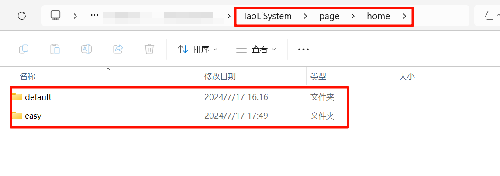

界面开发与主循环调用
====================

.. warning:: 桃丽系统 v2.1.0 之后调整了目录架构，并且允许用户自行修改主页面的样式，所以此章节的内容有所变动。

系统中有三大界面：主界面、设置界面、插件界面。与其它页面不同的是，它们是直接由 `TaoLiSystem/core/loader.py` 循环调用的。其中主界面可以有多个，但是设置界面、插件界面只能有一个。

这些界面存在于目录 `TaoLiSystem/page` 文件夹下，并在 `TaoLiSystem/core/loader.py` 代码中做了登记，查看 `loader.py` 文件，您可以找到下面这段代码：

.. code-block:: python
	
	# 全部页面模块
	pages = []

	pages.append("TaoLiSystem.page.setting")
	for _ in __import__('json').loads(configData.read('system', 'homePages', '["default"]')):
		pages.append("TaoLiSystem.page.home." + _)
	pages.append("TaoLiSystem.page.plugin")

	page_id = int(configData.read('system', 'page_id', '1'))  # 当前页面
		
.. important:: 虽然在系统设置之初有考虑可以更换页面的顺序的功能，但是系统中的 `设置页面` 和 `插件页面` 并未完全做好页面的切换准备（作为系统边界，您不应该随意调整 `TaoLiSystem.page.setting` 和 `TaoLiSystem.page.plugin` 的位置），如果你有这个需求，请提交 Issue 或者 PR 到仓库，我们将进一步测试更换页面的顺序可能性。
	
主循环调用
----------

系统有一个主循环，用来维持系统不会被意外代码终止而意外退出。此代码存在于 `TaoLiSystem/core/loader.py` 中，但 `TaoLiSystem/core/loader.py` 没有界面绘制的能力（没有在 `TaoLiSystem/core/loader.py` 中直接绘制主界面，为了面向对象，明确各个代码的分工。），所以就调用 ``pages`` 变量里的模块来绘制。

.. note:: pages 并未直接导入上面的模块，而是根据提供的字符串来动态导入模块。

比如按照上述代码，系统会调用 `TaoLiSystem.page.home.<指定的主页>` 模块中的 ``show()`` 函数来绘制，这个是代码预先规定好的。

页面加载、退出的逻辑由 `TaoLiSystem/core/loader.py` 引导，当切换页面时（按下 A 键或 B键）， `TaoLiSystem/core/loader.py` 会等待界面模块中 ``show()`` 函数执行完毕，再调用界面模块中的 ``close()`` 函数。在 ``close()`` 函数执行完毕之后， `TaoLiSystem/core/loader.py` 会清理界面模块本身以及其导入的其它模块，清理结束后调用其它界面模块。

.. note:: 模块的导入与删除，参照 `TaoLiSystem/core/loader.py` 文件中的，``importModule()`` 函数和 ``close_module()`` 函数。

界面代码设计
------------

.. important:: 这一小节是介绍基本的界面代码设计，如果你想要进行自定义主页的需求，可以参考 `自定义主页`_ 。

界面是允许插入与更新的，您可以自己写一个界面并插入到 `TaoLiSystem/core/loader.py` 页面模块列表之中。但是最好插入在 `TaoLiSystem.page.setting` 之后，或者 `TaoLiSystem.page.plugin` 之前，因为这两个界面是系统的“边界”。

.. note:: 虽然您可以直接在 `loader.py` 中直接增加一个页面的模块路径，但是由于新版本的更新，我们更建议您在设置中添加或修改您的页面编排。详细内容可以查看 :ref:`页面编排` 和 `自定义主页`_ 小节。

假设我新建了一个 `testUI.py` 在 `TaoLiSystem/page` 文件夹下，您必须至少在 `testUI.py` 中包含如下内容：

.. code-block:: python

    def show():
        # main.py 会反复调用这个函数
        pass

    def close():
        # 界面关闭时，会先调用这里。
        pass

然后在 `main.py` 的 ``pages`` 列表中插入 ``TaoLiSystem.page.testUI`` ，如下：

.. code-block:: python

	# 全部页面模块
	pages = ["TaoLiSystem.page.setting", 
			 "TaoLiSystem.page.home." + configData.read("system", "homePage", "default"),  # 这一句是可以切换主页的前提 
			 "TaoLiSystem.page.testUI", 
			 "TaoLiSystem.page.plugin"]
	page_id = 1  # 当前页面

然后重启掌控板，按下 B 键，就会进入到 `testUI.py` 中 ``show()`` 函数中了。

.. important:: 

	* 因为界面的模块是动态导入与动态释放的，所以模块中的所有代码都会在导入的时候再次执行，不必当心重复导入代码不执行的问题。
	* 界面的按键判断是通过 `按键中断 <https://mpython.readthedocs.io/zh-cn/master/tutorials/basics/buttons.html>`_ 的，所以即使界面模块销毁，按键 A 或 按键 B 的按下事件仍会触发。

你可以通过下面的代码暂时禁止 `main.py` 设置的按键中断：

.. code-block:: python

	# 记录原本按钮绑定函数
	button_a_callback_o, button_b_callback_o = button_a.event_pressed, button_b.event_pressed
	button_a.event_pressed, button_b.event_pressed = None, None

	# do something......

	# 还原按键中断
	button_a.event_pressed, button_b.event_pressed = button_a_callback_o, button_b_callback_o

.. _自定义主页:

自定义主页
------------

.. warning:: 桃丽系统 v2.1.0 之后允许用户自行修改主页面的样式，所以你可以自己 DIY 一个主页。

界面均保存在 `TaoLiSystem/page/home/` 下，你只需要新建一个文件夹，并在这个文件夹中放入 `__init__.py` 即可被掌控板正确识别到。

当然，光这样还不行，你需要在里面写相对应的代码，你的代码至少包含以下内容：

.. code-block:: python
	
    def show():
        # main.py 会反复调用这个函数
        pass
	
	def setting():  #  这个函数如果没有就不会调用，默认禁用 “个性化设置” 选项。
		# 设置页面的 “个性化设置” 选项会调用这里
		pass
	
    def close():
        # 界面关闭时，会先调用这里。
        pass

.. important:: 你设计的页面如果只包含以上内容那只有最简单的“绘制”功能，如果还需要熄屏等功能，需要自行处理其他逻辑，你可以参考 `easy/__init__.py` 的内容，学习一个简单的界面是如何处理逻辑的：

.. code-block:: python
	
	# 负责主页面绘制
	import sys
	import time
	from mpython import *

	from TaoLiSystem.core import sysgui, utils
	from TaoLiSystem.modules import bin2picture
	from TaoLiSystem.core.config import *

	# ===================================开始初始化桌面===================================

	# 清理一下掌控板启动完毕之后的内存冗余
	utils.gc_collect()

	# **********************************配置读取**********************************
	# 用于熄屏倒计时
	if configData.read("system", "ScreenOffStatus") == "1":  # 设置熄屏
		ScreenOffTimeout = int(configData.read("system", "ScreenOffTimeout", "-1"))
		ScreenOffStatus_sleep = int(configData.read("system", "ScreenOffStatus_sleep", "0"))
	else:  # 没有设置熄屏
		ScreenOffTimeout = -1
		ScreenOffStatus_sleep = 0  # 是否启用浅度睡眠熄屏

	# screenOff_countdown 是拿来倒计时的
	# ScreenOffTimeout 是预设的倒计时秒数，如果为 -1 说明没有启用熄屏
	screenOff_countdown = ScreenOffTimeout

	# **********************************变量定义**********************************
	# 记录上一时刻时间
	pre_time = time.localtime()

	# 绘制时间所需字体文件
	albbhp_font_fp = open("TaoLiSystem/static/font_albbhp.bin", "rb")
	albbhp_map = {':': 919, '0': 525, '1': 574, '2': 611, '3': 646, '4': 683, '5': 724, '6': 759, '7': 800, '8': 835, '9': 878}
	weekday_abbr = ['周一', '周二', '周三', '周四', '周五', '周六', '周日']

	# 用于对于先前按钮的记录
	button_a_callback_o, button_b_callback_o = button_a.event_pressed, button_b.event_pressed  # 记录原先的按钮

	# ===================================初始化桌面结束===================================

	def show():
		global pre_time, screenOff_timeout, screenOff_countdown
		
		t = time.localtime()
		
		# ==================================基本熄屏逻辑开始==================================
		# 熄屏逻辑
		if pre_time[5] != t[5]:
			if ScreenOffTimeout != -1 and screenOff_countdown <= 0:
				oled.poweroff()  # 关闭电源
				
				button_a.event_pressed, button_b.event_pressed = button_callback, None  # 禁用原先的按钮
				if ScreenOffStatus_sleep:  # 进入深度睡眠
					print("已进入浅度睡眠。")
					utils.lightsleep_irc(tip=False)
					time.sleep_ms(100)  # 等一手
					button_callback(0)  # 模拟亮屏启动
				
				return
			elif ScreenOffTimeout != -1:
				screenOff_countdown -= 1
		# ==================================基本熄屏逻辑结束==================================
		
		# ==================================主要界面元素绘制开始==================================
		# 时间绘制
		oled.fill(0)
		sysgui.draw_string_from_bin(38, 12, albbhp_font_fp, "%02d" % (t[3]), albbhp_map)
		
		sysgui.draw_string_from_bin(70, 12, albbhp_font_fp, "%02d" % (t[4]), albbhp_map)
		
		if t[5] % 2:     
			sysgui.draw_string_from_bin(62, 10, albbhp_font_fp, ":", albbhp_map)
		
		# 日期
		sysgui.draw_string_center("%04d年%02d月%02d日" % (t[0], t[1], t[2]), 38)
		
		oled.show()
		# ==================================主要界面元素绘制结束==================================
		
		pre_time = t

	def button_callback(_):  # 熄屏唤醒
		global button_a_callback_o, button_b_callback_o, screenOff_countdown, ScreenOffTimeout
		button_a.event_pressed, button_b.event_pressed = button_a_callback_o, button_b_callback_o  # 还原按钮
		screenOff_countdown = ScreenOffTimeout
		oled.poweron()
		oled.show()

	def setting():
		# ===========================个性化设置===========================
		while True:
			settings = []
			
			settings.append("关于此主页")
			
			choice = sysgui.itemSelector("个性化设置", settings)
			if choice == 0:
				sysgui.tipBox("简单页面示例")
			else:
				break
		# ===========================个性化设置===========================
		return

	def close():
		albbhp_font_fp.close()

如果你只是简单开发，你只需要在 “主要界面元素绘制” 代码段修改就行了，而后您可以在编辑器（如 Thonny）中，上传你的代码到 `TaoLiSystem/page/home/easy` 下，按下 Ctrl + D 重启掌控板，输入 `from TaoLiSystem.page.home import easy;easy.show()` ，查看绘制一帧的效果。
