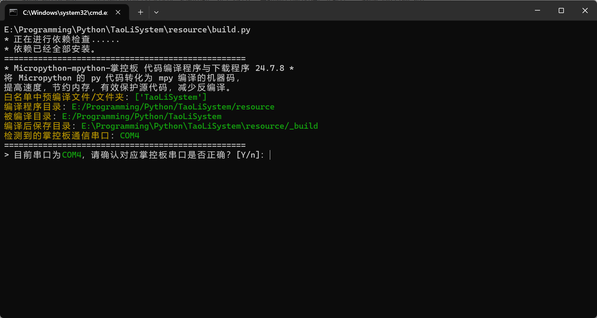
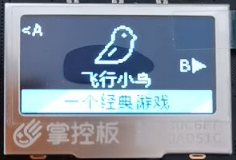
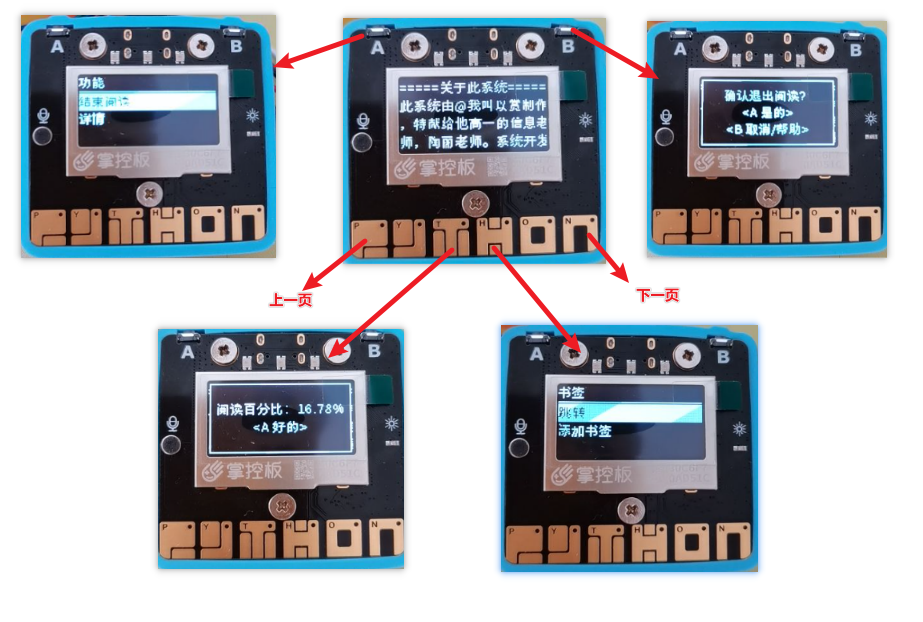

使用桃丽系统
================

本章节将介绍如何使用桃丽系统，在这一章节，我们会将所有开发时涉及的界面内容进行讲解。界面的介绍顺序按照系统启动的流程进行。

构建与下载工具 build.py 
------------------------

build.py 文件位于 `resource` 文件夹下，用于一键编译 TaoLiSystem 并上传到掌控板中。无 Python 环境的同学请双击 `resource` 目录下的 `@run_build.bat` 文件。 程序编写时的环境为 `Python 3.9` 推荐使用 `3.9.0` 及以上的 Python 版本运行、修改源代码。

原理介绍
^^^^^^^^

编译使用 Micropython 源代码中编译的 mpy-cross 程序，mpy-cross 是 MicroPython 编译器工具链的一部分，专门用于将 MicroPython 脚本预编译成字节码，程序会将 py 文件编译成 mpy 文件，可以提高执行效率和节省存储空间。想要研究的同学可以前往： `Micropython 开源项目 <https://github.com/micropython/micropython>`_ 中查看，mpy-cross 位于项目的 `mpy-cross` 文件夹中。

.. note:: 在 Windows 上编译 mpy-cross 需要 MSYS2 MINGW64 环境，在较早的 Micropython mpy-cross 编译可能会报错，请使用 ``make CFLAGS_EXTRA="-Wno-dangling-pointer -Wno-enum-int-mismatch"``  命令编译来禁止编译器报告悬空指针的警告和禁止编译器警告枚举类型与整数类型之间的不匹配。新版本 Micropython 中已经修复。

而连接掌控板传输文件使用的是 MicroPython 官方的 `pyboard.py` 代码。

操作说明
^^^^^^^^

.. note:: 程序在执行时默认均为 `Yes` 即确定，只有输入 `N 或者 n` 才可以标识否。

具体操作请查看 `安装桃丽系统 <quickstart.html>`_ 。

系统配置工具 setting.py 
------------------------

.. warning:: 由于 v2.1.0 系统将配置文件的存储方法从原生的读取 ini 配置文件改为了 btree 数据库存储，虽然加快了配置的读取和写入但是也增加了在电脑上修改配置文件的难度。所以编写了这个程序。

setting.py 文件位于 `resource` 文件夹下，用于直接修改 TaoLiSystem 在掌控板中的配置。无 Python 环境的同学请双击 `resource` 目录下的 `@run_setting.bat` 文件。 程序编写时的环境为 `Python 3.9` 推荐使用 `3.9.0` 及以上的 Python 版本运行、修改源代码。

操作说明
^^^^^^^^

连接掌控板到电脑，而后打开程序，并确认端口后连按两次回车，你可以看到如图所示的内容：

注意程序一开始将输出所有配置项，如果你的系统还有进行任何设置，列表将会是空的。

命令说明
^^^^^^^^

+ `set` [设置项名称]=[设置项设定值]       更改设置项状态　
+ `del` [设置项名称]      删除设置项　
+ `export`        备份设置项到电脑
+ `import`        从电脑恢复设置项
+ `show`  展示所有配置项　
+ `help`  查看帮助
+ `bye`   重启掌控板，退出程序　

比如你可以这样设置一项：

	
同时可以备份和恢复设置项：

.. image:: ../_static/setting_export.png

BootLoader 模式
---------------

.. warning:: 此内容针对想要开发的同学，仅使用的同学可以跳过。

原理介绍
^^^^^^^^

掌控板一开始会调用 boot.py 文件，同样，我们在 boot.py 文件中也写了一些内容。boot.py 主要用于代码备份与恢复。

需要知道的是 boot.py 在调用结束之后，就会调用 main.py ， main.py 是掌控板的主要代码程序，所有 micropython 的 IDE 在刷入代码时都会修改 main.py 而不是 boot.py 。所以 boot.py 自然就成了代码备份的最佳选项。通过 boot.py 可以模拟“双系统”。

首先需要准备一个 main.py.bak 放在掌控板文件的根目录下，与 boot.py 和 main.py 同级。main.py.bak 文件便是我们备份的代码，而 main.py 是默认掌控板启动执行的代码。

操作说明
^^^^^^^^

|

.. image:: ../_static/welcome_bootLoader.png
   :align: center

|

在掌控板重启的时候显示LOGO时，同时按下按键A和B键，并等待LOGO消失数秒后，松开A和B键。掌控板将进入 BootLoader 模式，此时长按 A 键，等待掌控板重启，便可进入备份的代码（main.py.bak）。

内部逻辑
^^^^^^^^

* 当按下A，``main.py`` 变为 ``main.py.main``。``main.py.bak`` 变为 ``main.py`` 系统重启。
* 第一次重启时，将 ``main.py.main`` 变为 ``main.py.main_`` 表示已经运行了备份的代码，并在下一次重启时换回代码。
* 下一次重启，程序发现有 ``main.py.main_`` 便将 ``main.py`` 变为 ``main.py.bak``；将 ``main.py.main_`` 变为 ``main.py`` 。
* 因为掌控板没有检查文件是否存在的函数，所以使用 try 语句来拦截报错。

----------------------------------------------------------------------

主界面
------

|

|

界面介绍
^^^^^^^^

主界面是系统三大界面之一，在初次进入主界面时会有欢迎提示。主界面会显示时间和日期，最上面还有一行非常小的倒计时进度条。

功能说明
^^^^^^^^

* 在主界面按下 A 可以进入 **设置界面** ，按下 B 可以进入 **插件界面** ，这两个页面在之后会介绍。
* 在主界面按下触摸按键 P 可以打开 **计时器** ，按下 Y 可以 **掷骰子** ，按下 N 可以 **查看设备电源电压** （需要打开拓展板开关，3.7V为满格电压，老的拓展板不支持，按下会死机。）

计时器
^^^^^^

|

|

* 在计时器页面按下 A 键会启动计时器，B 键会退出计时器。
* 启动后，按下 A 键会停止计时器，B 键会记录当前时间。
* 停止后，按下 A 键继续计时器，B 键会归零。
* 在停止时，长按触摸按键 P 可以调出历史时间记录。（在此页面按 A 或 B 退出，实际上这个归属于 `物品选择页面`_ 。）

掷骰子
^^^^^^

|

.. image:: ../_static/welcome_1to6.png
   :align: center

|

* 弹出页面后等待数字稳定，就是您投出点数。

电压查看
^^^^^^^^

|

|

* 长按 N 然后松开，即可查看拓展板电池电压。

----------------------------------------------------------------------

设置界面
--------

|

|

界面介绍
^^^^^^^^

设置界面初次进入时会有使用提示，中间显示设置图标，下方会有设置项与设置项简介。左侧是切换提示，右侧也是切换提示。当界面到底时，切换提示会消失或显示“B>”意味着返回主界面。

功能说明
^^^^^^^^

* 有切换提示时，按下 A 键或 B 键切换设置项，出现“B>”并按下 B 键退出设置界面。
* 长按触摸按键 P 并等待大约三秒可以进入设置项。

由于详细设置大抵相同所以此处先不多介绍，详细查看 `物品选择页面`_ 。

----------------------------------------------------------------------

插件界面
--------

|

|

插件界面初次进入时会有使用提示，中间显示插件图标，下方会有插件名称与插件短的简介。左侧是切换提示，右侧也是切换提示。当页面到底时，切换提示会消失或显示“<A”意味着返回主界面。

功能说明
^^^^^^^^

* 有切换提示时，按下 A 键或 B 键切换设置项，出现“<A”并按下 A 键退出插件界面。
* 长按触摸按键 P 并等待大约三秒可以进入插件。
* 长按触摸按键 N 并等待大约三秒可以查看插件详情。

----------------------------------------------------------------------

.. _全屏选择页面:

全屏选择页面
------------

|

|

界面介绍
^^^^^^^^

全屏选择页面是桃丽系统提供的界面之一，用于获取用户的选择项，便于开发，比如扫描WIFI后会来到这个页面。

全屏选择页面下方是提示，上方是选择项。

* A 键确认，B 键取消。
* 触摸 P 上一个，触摸 N 下一个，触摸 T 第一个，触摸 H 最后一个。

----------------------------------------------------------------------

.. _物品选择页面:

物品选择页面
------------

|

|

物品选择页面是桃丽系统提供的界面之一，用于获取用户的选择项，便于开发，详细的函数调用查看开发部分。这里仅阐述如何使用。
使用物品选择页面的界面有：系统的详细设置、秒表记录查看页面等。这里使用“时间设置选项”页面进行演示。

物品选择页面上方显示选择器名称，横线下方是选择项。白背景黑字显示的是目前选择项。

功能说明
^^^^^^^^

* A 键确认，B 键取消。
* 触摸 P 选择上一项，触摸 N 选择下一个，触摸 T 选择第一项，触摸 H 选择最后一项。

----------------------------------------------------------------------

.. _文字输入页面:

文字输入页面
------------

|

|

文字输入页面是是桃丽系统提供的界面之一，用户获取用户的输入，便于开发。
使用文字输入页面的界面有：WIFI密码输入页面、日期时间输入页面。

横线上方是目前输入的文字，“|”是光标，横线下方是输入的字（字组）。

功能说明
^^^^^^^^

* 刚进入时，是字组选择页面。按下触摸 P 选择上一页字组，按下触摸 N 选择下一页字组。
* 在字组选择页面，按下触摸 Y、T、H、O 选择字组进行输入。
* 按下触摸 Y、T、H、O 任意之后，进入输入页面。按下 A 键输入文字，按下 P 向左选择文字，按下 N 向右选择文字，按下 T 选择第一个文字，按下 H 选择最后一个文字。触摸 O 是切换大小写。
* 在输入页面或字组选择页面按下 B 键都会加入功能模式，进入后再按一次退出。
* 在功能页面，按下 P 光标左移，N 光标右移，T 删除，H 加入空格。
* 在功能页面或者字组选择页面按下 A 会确认输入。

----------------------------------------------------------------------

.. _文本读取页面:

文本读取页面
------------

|

|

文本读取页面是是桃丽系统提供的界面之一，便于用户读取长文本。
使用文本读取页面的界面有：系统关于、WIFI详情等。

功能说明
^^^^^^^^

* A 键加入功能模式，B 键退出或者获取帮助。
* 触摸 P 键上一页，触摸 N 键下一页。
* 触摸 T 获取阅读百分比，触摸 H 添加书签。

.. _页面编排:

页面编排
---------

切换首页
^^^^^^^^^^

首先需要在首页按下 A 键进入设置页面，在设置页面连续按下两次 A 键找到 “掌控板选项” 。

|

|

长按 P 触摸按键进入设置项，并在选择页面按下 N 切换至 `主页设置` 。

|

|

按下 A 键，进入 `主页设置` 。

.. note:: 在打开后看到的页面中可以按下 P N 触摸按键进行左右切换选择页面不同的页面进行调整。

|

|

|

|

按下 A 键，并选择 `替换页面` 。

.. note:: 在这里你可以对选择的页面进行替换、删除以及个性化设置，还能在前面插入或者在后面插入页面。

|

|

你可以看到可供替换的页面，如果你想要自定义页面，或者添加更多页面，请参照 :ref:`自定义主页` 。

按下 A 键就可以替换页面：

|

|

按下 A 确认之后，会自动返回页面选择页面。

|

|

按下 B 键，再按下 A 键保存更改。

|

|

完成之后，页面就已经更新了。