安装桃丽系统
================

本章节将介绍如何下载并安装桃丽系统，为了让各位同学都可以方便地安装此系统，所以我将会分布罗列方法。

准备材料
--------

我们需要用到如下的硬件/软件：

* 掌控板、数据线
* mPython IDE（后文将给出下载地址）
* `Thonny IDE <https://thonny.org/>`_ （请自行下载安装）

安装驱动与烧录固件
~~~~~~~~~~~~~~~~~~

完整的安装驱动与烧录固件过程请参考官方文档的 `驱动下载 <https://mpython.readthedocs.io/zh-cn/master/board/drive.html>`_ 和 `烧录固件 <https://mpython.readthedocs.io/zh-cn/master/board/flashburn.html>`_ 章节。

我们使用一种最简单的方法来完成这一步，打开 `盛思官方网站 <https://www.labplus.cn/software>`_ 下载 mPython IDE 并安装。

|

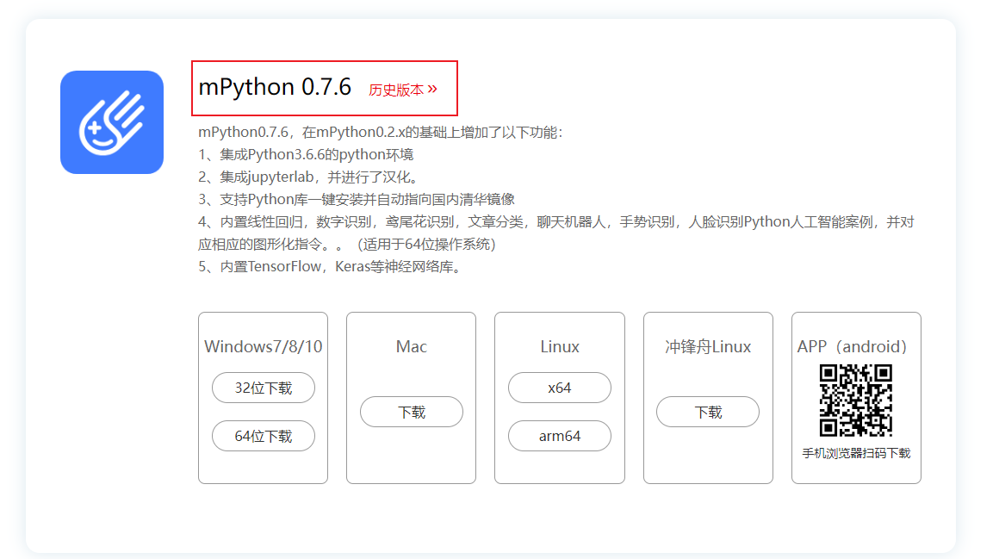

|

安装过程中会自动安装掌控板所需的驱动，等待安装完成，打开软件并用数据线连接掌控板，接下来我们需要为掌控板刷固件。

**如果您的掌控板连接上电脑的一瞬间有在oled显示mPython的图标，说明您的掌控板已经内置了固件可以跳过下面的步骤。**

打开 mPython IDE 之后，点击上方的“未连接”的字样，并点击“连接COMX”（X指数字，当您的电脑上有多个掌控板时数字会不一样）。

|

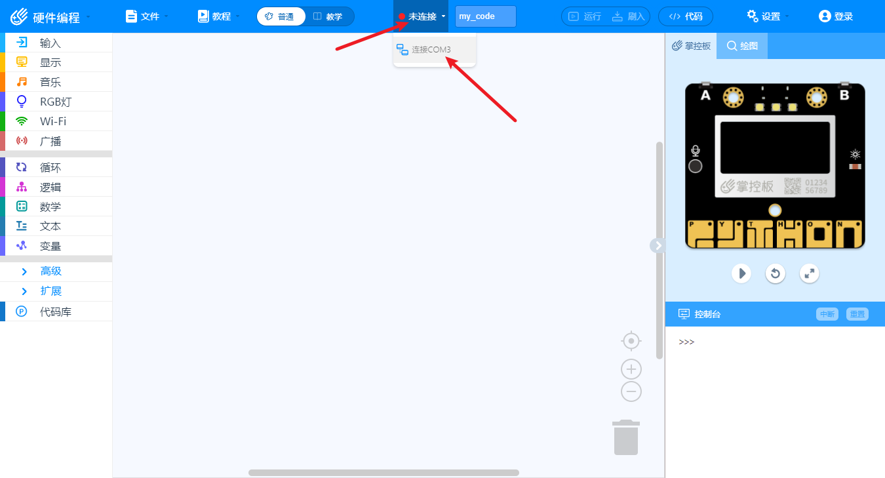

|

如果您的并没有“连接COMX”的字样，请换切换串口连接设备（换一个USB口插）。如果还不行，请确认数据线是否可以使用（部分充电线没有数据传输功能）。最后如果上述均未错误，请检查掌控板是否损坏。

如果提示连接成功，我们可以进入下一步。依次点击右上角的“设置”->“烧录固件”->“确定”，即可烧录固件。

|

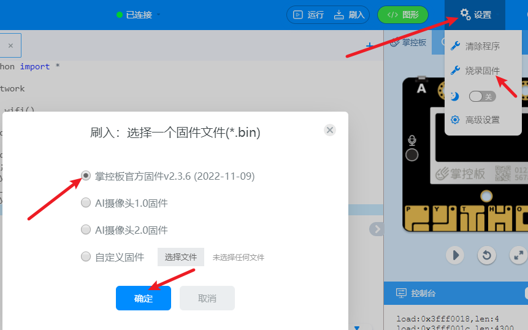

|

克隆桃丽系统仓库
----------------

克隆顾名思义就是复制仓库的代码到您自己的电脑上面，打开桃丽系统的开源仓库 `码云 <https://gitee.com/wojiaoyishang/TaoLiSystem/>`_ 或 `github <https://github.com/wojiaoyishang/TaoLiSystem/>`_ 。

下载分支里的内容，（码云需要登录，Github可以不用）

|

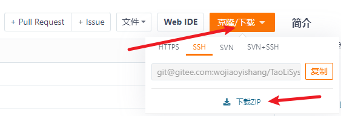

|

使用脚本上传桃丽系统到掌控板（推荐）
-------------------------------------

.. note:: 此方法仅限于 Windows 。

说明
~~~~~

如果仅是快速体验桃丽系统的同学，推荐使用一键下载脚本。不出意外，在完成第一步后，您将会看到以下内容：

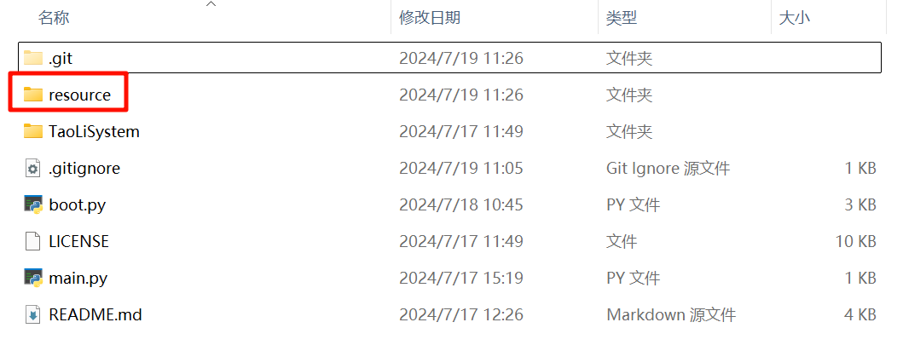

打开 `resource` 文件夹，里面保存的是一些开发工具以及说明文档。

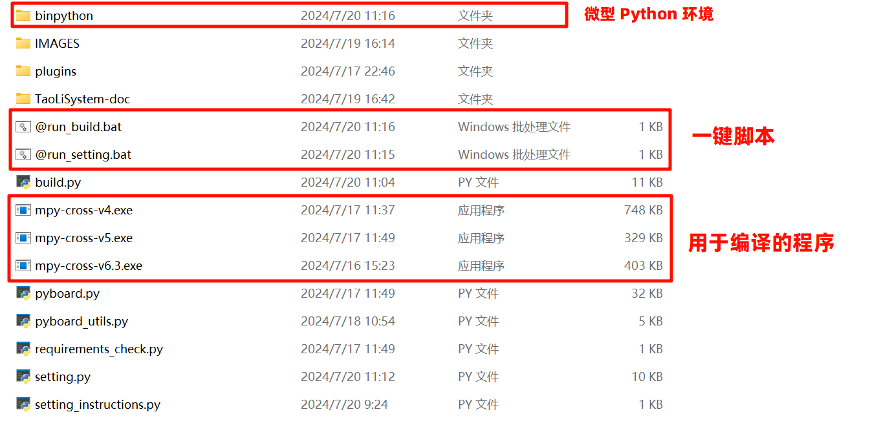

其中， `@run_build.bat` 是用于编译系统以及下载到掌控板中的，对于为什么需要的编译我们将在后文解释。 `@run_setting.bat` 是用于调整掌控板中的系统设置的。

**如果您的电脑有预装 Python 的环境（推荐版本 `>=3.9` ），可以直接运行相对应的 `build.py` 和 `setting.py` 源代码文件，上述的  `@run_build.bat` 和 `@run_setting.bat` 本质上就是在调用已经编译好的 `build.py` 和 `setting.py` 。**

断开掌控板连线（如果有提前连接掌控板）
~~~~~~~~~~~~~~~~~~~~~~~~~~~~~~~~~~~~~~~~~~~~~~

如果掌控板先前已经连接电脑请先断开，以防端口被其他程序占用（或者在其他程序中断开串口连接）。

打开 `@run_build.bat` 将掌控板连接电脑
~~~~~~~~~~~~~~~~~~~~~~~~~~~~~~~~~~~~~~~~~~~~~~

程序会自动检测端口，并显示在“黑窗口”中，如果端口写的是“无”，请手动输入端口，或者重新打开程序。

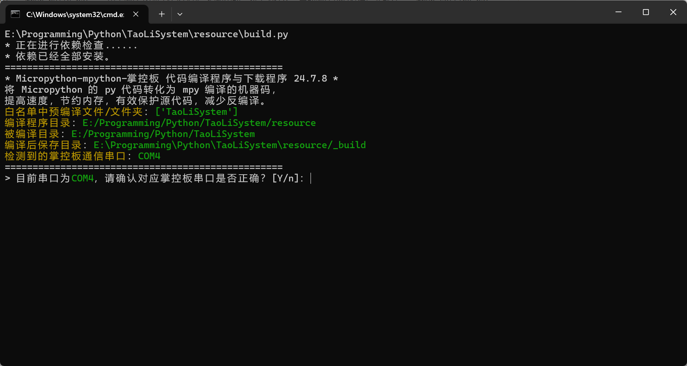

选择编译器
~~~~~~~~~~~~

如果你不知道怎么选择编译器，请按两下回车，程序会自动连接掌控板并检测所需编译器。

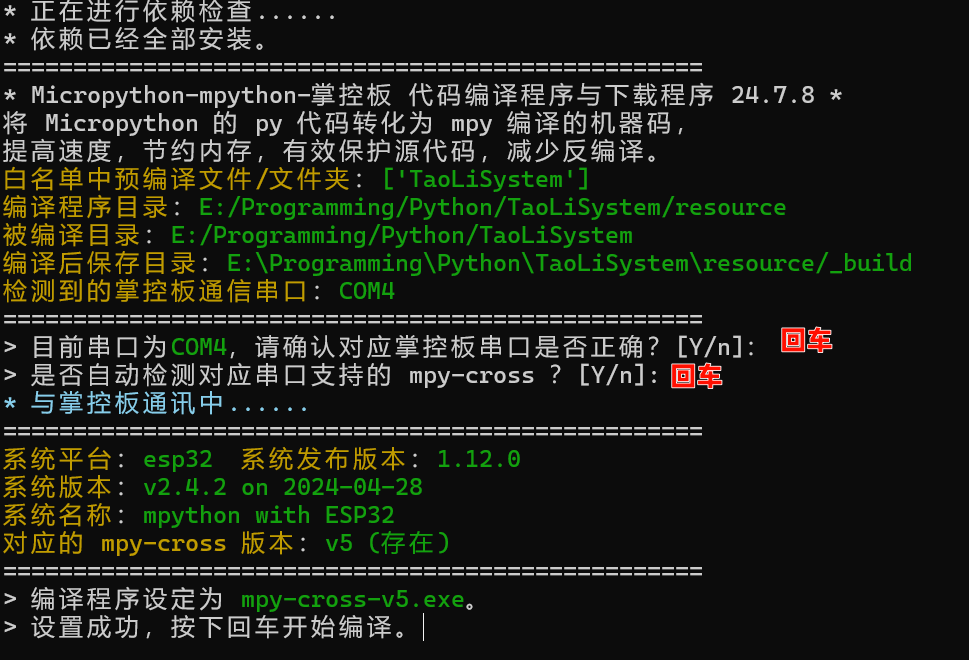

编译的文件就是同一命令下的以 `mpy-cross` 开头的文件，需要根据你的掌控板中的 Micropython 版本进行选择。

如果你要手动确认 Micropython 版本，请先连接掌控板，而后使用串口通讯工具（或者支持 Micropython 编程的程序中，如 Thonny）输入：

.. code-block:: shell

    print(list(__import__('os').uname()))

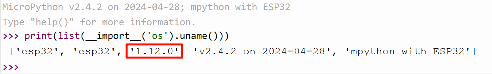

找到第三项，就是 Micropython 的版本，之后按照如下的表选择对应的 mpy-cross 版本：

 ===================== ============== ======= 
  MicroPython release   .mpy version   是否已编译  
 ===================== ============== ======= 
  v1.23                 6.3            √      
  v1.22                 6.2                   
  v1.20 to v1.21        6.1                   
  v1.12 to v1.18        5              √      
  v1.11                 4              √      
  v1.9.3 - v1.10        3                     
  v1.9 - v1.9.2         2                     
  v1.5.1 - v1.8.7       0                     
 ===================== ============== ======= 

推荐使用最新的 mpython 掌控板固件，截至 2024年7月19日，最新的 mpython 掌控板固件支持的是 `mpy-cross-v5`，如果你需要更新或者更旧的 mpy-cross 编译程序，可能需要自行编译。

开始编译
~~~~~~~~~~

请等待编译完成，会在当前目录下生成 `_build` 文件夹，你可以在传输到掌控板之后删除。

.. image:: ../_static/image15.png

下载到掌控板
~~~~~~~~~~~~

编译完成之后，会提示是否上传到掌控板，按下回车确定。

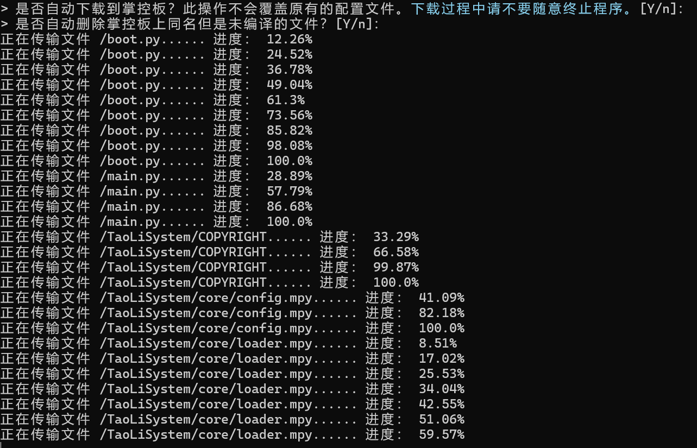

**下载过程不要中断程序，直至掌控板中提示传输完成后按下回车键重启掌控板。**

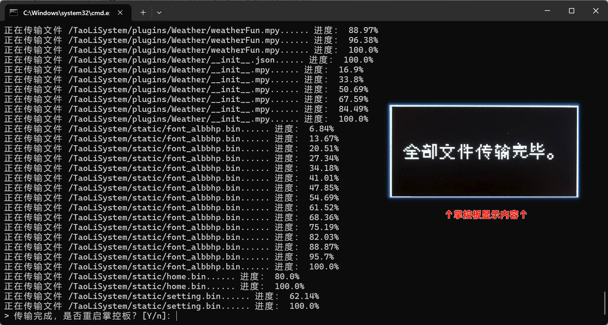

自行上传桃丽系统到掌控板
----------------------------

打开 Thonny IDE ，点击菜单栏 `Tools（工具）` -> `选项...` ->上方选项卡 `Interpreter（解释器）` -> `选择esp32` -> `选择端口` -> `好的` 。等待 Thonny IDE 连接掌控板。

|

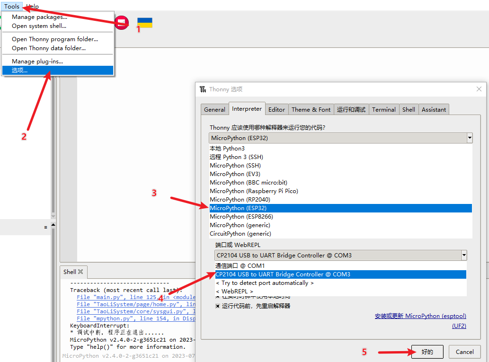

|

连接后您会在左侧看到您电脑的文件（左上）和您掌控板的文件（右下），在左上角找到您刚刚解压文件的地方（tip: 点击左上的蓝字可以选择文件夹），然后选择第一项，按住 Shift 选择最后一项，右键 “Upload to /” 上传到掌控板根目录。

|

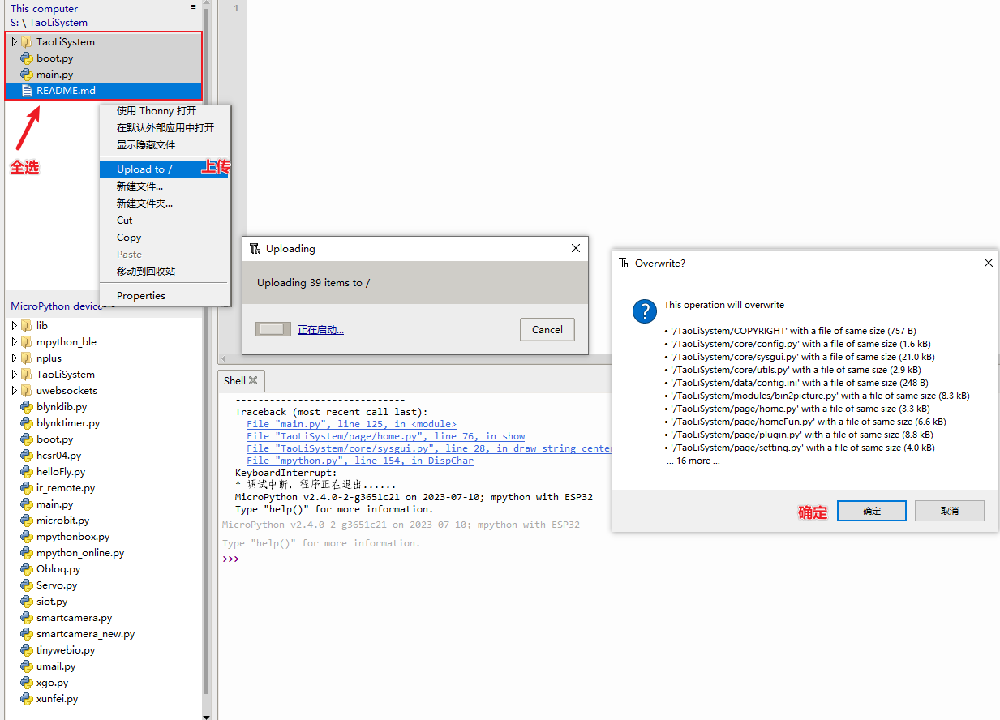

|

按下掌控板背后的 “rst” 按键重启掌控板，或者在 Thonny IDE 主页面按下 Ctrl + D 重启掌控板。您就可以进入陶丽系统了。

其他说明
---------

关于一键下载程序和配置程序为什么使用 UPX 压缩？为什么我的杀毒软件报毒？
~~~~~~~~~~~~~~~~~~~~~~~~~~~~~~~~~~~~~~~~~~~~~~~~~~~~~~~~~~~~~~~~~~~~~~~~~~~~~

Python 编译后的文件非常大，为了减少程序体积采用了 UPX 压缩。编译的文件主要是提供给没有预装 Python 环境的同学使用的，避免的繁琐的操作。对于杀毒软件报毒是因为 UPX 压缩技术会造成误报，如果你不放心可以直接使用 Python 运行相对应的 `build.py` 和 `setting.py` 。顺带一提，`build.py` 和 `setting.py` 已经经过调整，可以直接在 IDLE 中打开运行，鲁棒性很好，可以不用命令行调用。Like This：

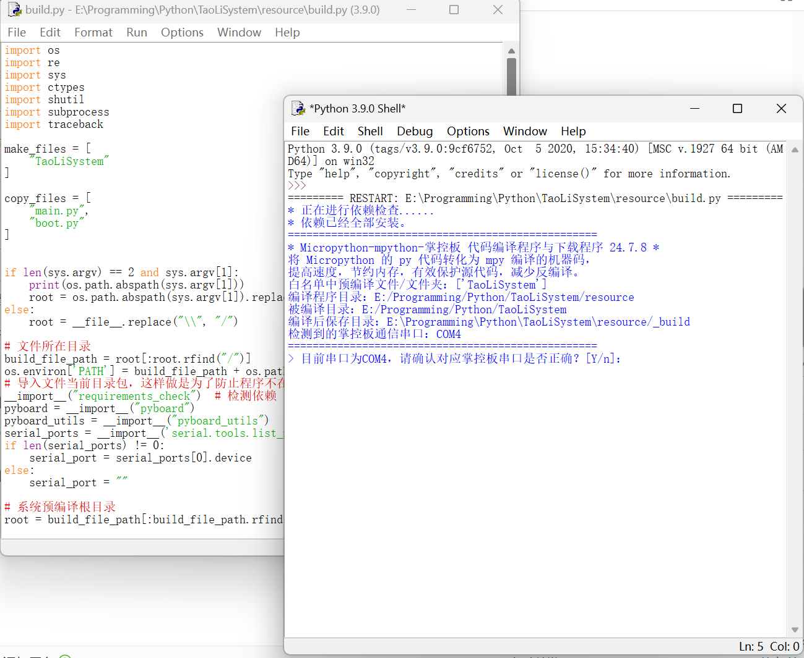

关于编译程序 mpy-cross 为什么需要？用了什么技术？
~~~~~~~~~~~~~~~~~~~~~~~~~~~~~~~~~~~~~~~~~~~~~~~~~~~~~~~~~~~~~~~~~~~~~~~~~~~~~

掌控板的 mpython 固件实际上就是在 Micropython 上修改加工而来的，而 mpy-cross 是 MicroPython 编译器工具链的一部分，专门用于将 MicroPython 脚本预编译成字节码，程序会将 py 文件编译成 mpy 文件，可以提高执行效率和节省存储空间。原来是用 C 语言写的，mpy-cross 程序是直接从源码编译过来的。

掌控板中系统先调用 mpy 文件还是 py 文件？
~~~~~~~~~~~~~~~~~~~~~~~~~~~~~~~~~~~~~~~~~~~~~~~~~~~~~~~~~~~~~~~~~~~~~~~~~~~~~

先调用 py 文件，所以在开发时可以混用非常方便。

其他
~~~~~~

如果你的掌控板已经安装了桃丽系统并开启了浅睡眠熄屏模式，在使用下载工具时请先唤醒掌控板。
